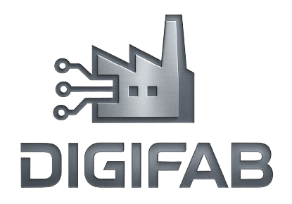

<div align="left" >
<center>
      <a href="./docs/assets/images/logo/digifab.png" align="center">
        
      </a>    
</center>
<center>
       <h1 style="display: inline-block; margin-left: 10px;">DigiFab - BackEnd</h1>
</center>
</div>

# Pós-Graduação em Engenharia de Software - Alunos do Grupo <br />
 - Rosival de Souza <br />
 - Felipe Griep <br />
 - Giulia Mendes <br />
 - Tiago Zardin <br />

# Projeto e desenvolvimento de web-app-api
<p align="left">
  
</p>

<!-- ABOUT THE PROJECT -->

## About The Project: Appeal Organization (Feature-based)


<!-- GETTING STARTED -->

## Getting Started
   **Create .env**
   ```sh
   DB_HOST=$DB_HOST
   DB_MYSQL=$DB_MYSQL
   DB_USER_MYSQL=$DB_USER_MYSQL
   DB_PASSWORD_MYSQL=$DB_PASSWORD_MYSQL
   ```

### Prerequisites

Before you begin, ensure you have met the following prerequisites:

- [Node.js](https://nodejs.org/) installed on your local machine
- npm or yarn package manager installed with Node.js

### Installation

Follow these steps to get your project up and running:

1. **Clone the repository**
   ```sh
   git clone https://github.com/rosival-souza/digifab-backend
   ```

2. **Navigate to the project directory**
   ```sh
   cd digifab-backend
   ```
   
3. **Install dependencies**
   ```sh
   npm install -D typescript
   ```
   ```sh
   npm install
   ```
4. **Start the development server**
   ```sh
   npm run dev
   ```
   Open your web browser and navigate to http://localhost:3000/digifab-backend to view this application.
